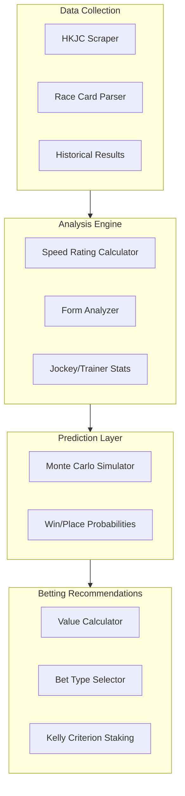
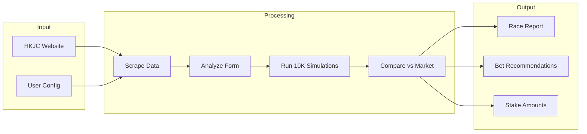
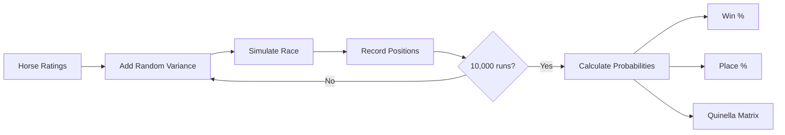
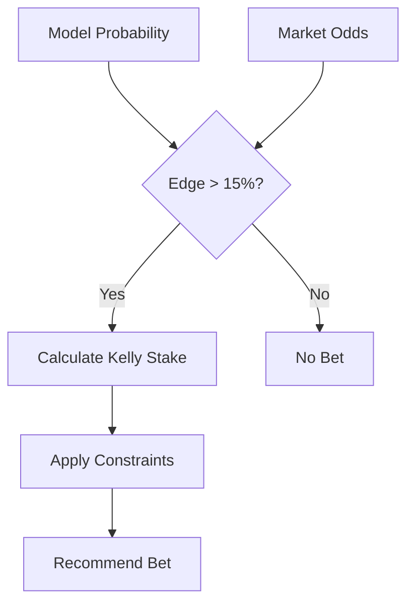

# HK Horse Racing AI

AI-assisted Hong Kong horse racing analysis and betting recommendation system.

## Overview

This project provides tools to:
- **Scrape** race data from HKJC (Hong Kong Jockey Club)
- **Analyze** horse performance using speed ratings, form analysis, and jockey/trainer statistics
- **Simulate** race outcomes using Monte Carlo methods
- **Recommend** value bets with Kelly Criterion staking

## Architecture



## Data Flow



## Project Structure

```
hourse-racing/
├── src/
│   ├── scrapers/           # HKJC data scrapers
│   ├── analysis/           # Statistical analysis modules
│   ├── simulation/         # Race simulation engine
│   ├── betting/            # Bet recommendation logic
│   ├── types/              # TypeScript interfaces
│   └── utils/              # Helper functions
├── data/                   # Cached race data (gitignored)
├── prompts/                # AI prompts for analysis
├── tools/                  # CLI tools
├── rules/                  # Cursor rules
└── skills/                 # Cursor skills
```

## Installation

```bash
npm install
npx playwright install chromium
```

## HKJC Data Sources

The system fetches data from the Hong Kong Jockey Club website using the following URLs:

### Horse Profile
```
https://racing.hkjc.com/en-us/local/information/horse?HorseId={horseCode}
```
- **Parameter**: `HorseId` - Full horse code (e.g., `HK_2024_K129`)
- **Returns**: Horse details, rating, sire/dam, career stats, past performances
- **Example**: [WINNING WING](https://racing.hkjc.com/en-us/local/information/horse?HorseId=HK_2024_K129)

### Jockey Statistics
```
https://racing.hkjc.com/en-us/local/information/jockeywinstat?JockeyId={jockeyCode}
```
- **Parameter**: `JockeyId` - Jockey code (e.g., `PZ` for Z Purton)
- **Returns**: Season stats (wins, rides, win rate), performance by venue/distance
- **Example**: [Z Purton Stats](https://racing.hkjc.com/en-us/local/information/jockeywinstat?JockeyId=PZ)

### Race Results
```
https://racing.hkjc.com/en-us/local/information/localresults?RaceDate={date}
```
- **Parameter**: `RaceDate` - Date in `YYYY/MM/DD` format
- **Returns**: All race results for that meeting, dividends, finish order
- **Example**: [19 Jan 2025 Results](https://racing.hkjc.com/en-us/local/information/localresults?RaceDate=2025/01/19)

### Race Card
```
https://racing.hkjc.com/en-us/local/information/racecard?RaceDate={date}&Racecourse={venue}&RaceNo={race}
```
- **Parameters**: 
  - `RaceDate` - Date in `YYYY/MM/DD` format **(must be a future/upcoming race date)**
  - `Racecourse` - Venue code (`ST` = Sha Tin, `HV` = Happy Valley)
  - `RaceNo` - Race number (1-11)
- **Returns**: Entries, draws, weights, jockeys, trainers
- **Note**: Race cards are only available for upcoming races. For past races, use Race Results instead.
- **Example**: Check [HKJC Fixtures](https://racing.hkjc.com/en-us/local/information/fixture) for upcoming race dates

### Current Odds
```
https://racing.hkjc.com/en-us/local/information/winodd?RaceDate={date}&Racecourse={venue}&RaceNo={race}
```
- **Returns**: Live win/place odds for all runners
- **Example**: [ST Race 1 Odds](https://racing.hkjc.com/en-us/local/information/winodd?RaceDate=2025/01/19&Racecourse=ST&RaceNo=1)

### Jockey Codes Reference

| Jockey | Code | Example URL |
|--------|------|-------------|
| Z Purton | `PZ` | [Stats](https://racing.hkjc.com/en-us/local/information/jockeywinstat?JockeyId=PZ) |
| J Moreira | `MOJ` | [Stats](https://racing.hkjc.com/en-us/local/information/jockeywinstat?JockeyId=MOJ) |
| J McDonald | `MCJ` | [Stats](https://racing.hkjc.com/en-us/local/information/jockeywinstat?JockeyId=MCJ) |
| H Bowman | `BH` | [Stats](https://racing.hkjc.com/en-us/local/information/jockeywinstat?JockeyId=BH) |
| M Guyon | `GM` | [Stats](https://racing.hkjc.com/en-us/local/information/jockeywinstat?JockeyId=GM) |
| K Teetan | `TEK` | [Stats](https://racing.hkjc.com/en-us/local/information/jockeywinstat?JockeyId=TEK) |
| A Badel | `BA` | [Stats](https://racing.hkjc.com/en-us/local/information/jockeywinstat?JockeyId=BA) |

### Horse Code Format

Horse codes follow the pattern: `HK_{year}_{brandCode}`

| Example Code | Description | Link |
|--------------|-------------|------|
| `HK_2024_K129` | Horse imported in 2024, brand K129 | [WINNING WING](https://racing.hkjc.com/en-us/local/information/horse?HorseId=HK_2024_K129) |
| `HK_2023_J169` | Horse imported in 2023, brand J169 | [APOLAR FIGHTER](https://racing.hkjc.com/en-us/local/information/horse?HorseId=HK_2023_J169) |
| `HK_2022_H447` | Horse imported in 2022, brand H447 | [FAMILY FORTUNE](https://racing.hkjc.com/en-us/local/information/horse?HorseId=HK_2022_H447) |

## Usage

### Scrape Today's Race Card
```bash
npm run scrape:racecard
```

### Analyze a Race
```bash
npm run analyze -- --race 5 --date 2026-01-29
```

## Simulation Process



## Value Detection



## Betting Strategy

Based on research, this system focuses on:
- **Exotic bets** (Quinella, Place, Quinella Place) - pools are less efficient
- **Value threshold**: Only bet when model edge > 15%
- **Kelly staking**: 25-50% fractional Kelly for bankroll management

## Key Prediction Factors

1. Speed ratings (adjusted for class/going)
2. Class trajectory (horses dropping in class)
3. Jockey/Trainer win rates
4. Draw bias (track/distance specific)
5. Recent form and fitness

## Disclaimer

This project is for educational and research purposes only. Gambling involves risk. Never bet more than you can afford to lose.
