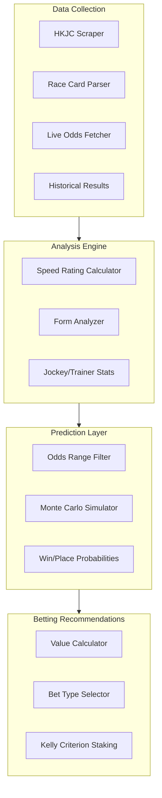
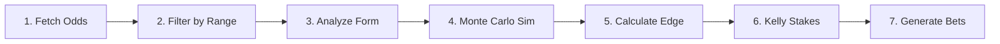
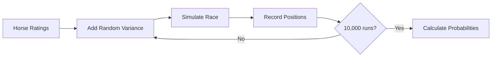
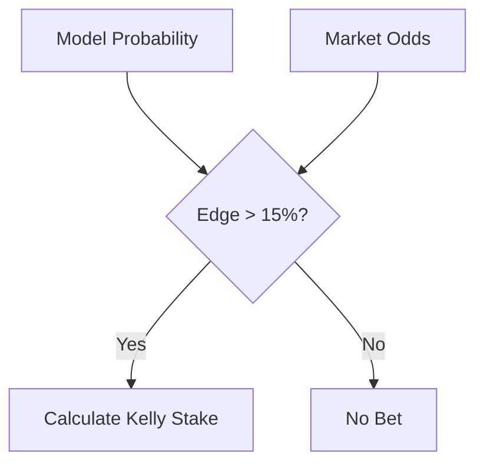

# HK Horse Racing AI

AI-assisted Hong Kong horse racing analysis and betting recommendation system.

## Overview

This project provides tools to:
- **Scrape** race data from HKJC (Hong Kong Jockey Club)
- **Fetch live odds** for upcoming races
- **Analyze** horse performance using speed ratings, form analysis, and jockey/trainer statistics
- **Simulate** race outcomes using Monte Carlo methods
- **Recommend** value bets with Kelly Criterion staking

## Architecture



## Quick Start

```bash
# Install dependencies
npm install

# Install Playwright browser
npx playwright install chromium

# Fetch current odds for a race meeting
npx tsx tools/fetch-odds.ts --date=2026-02-01 --venue=ST

# Analyze a specific race
npx tsx tools/analyze-race.ts --date=2026-02-01 --venue=ST --race=8
```

## CLI Tools

### Fetch Current Odds

Fetch live win/place odds from HKJC betting site.

```bash
# Fetch all races for a meeting
npx tsx tools/fetch-odds.ts --date=2026-02-01 --venue=ST

# Fetch specific race only
npx tsx tools/fetch-odds.ts --date=2026-02-01 --venue=ST --race=8

# Output as JSON
npx tsx tools/fetch-odds.ts --date=2026-02-01 --venue=ST --json

# Save to file
npx tsx tools/fetch-odds.ts --date=2026-02-01 --venue=ST --save
```

**Output:**
```
RACE 8
────────────────────────────────────────────────────────────────────
 # | Horse                    | Jockey          | WIN   | PLACE | Status
────────────────────────────────────────────────────────────────────
 1 | SAGACIOUS LIFE           | Z Purton        |   3.6 |   2.3 | ✓ WIN
 3 | INVINCIBLE IBIS          | H Bowman        |   2.9 |   1.5 | ✓ WIN
 4 | BEAUTY BOLT              | J McDonald      |   8.3 |   2.3 | -

SELECTIONS IN WIN RANGE (2.0-7.0):
  R8 #1 SAGACIOUS LIFE @ 3.6
  R8 #3 INVINCIBLE IBIS @ 2.9
```

**Output:**
```
ELITE TIER (Win % > 15%):
  ⭐ PZ Z Purton - 22.19%
  ⭐ MCJ J McDonald - 16.67%

STRONG TIER (Win % 10-15%):
  ✓ BH H Bowman - 12.11%
```

### Analyze Race

Run full analysis with Monte Carlo simulation.

```bash
npx tsx tools/analyze-race.ts --date=2026-02-01 --venue=ST --race=8
```

### Scrape Single Race Result

Scrape historical race results.

```bash
npx tsx tools/scrape-single-race.ts --date=2026-01-19 --venue=ST --race=1
```

### Scrape Full Meeting

Scrape all races from a meeting.

```bash
npx tsx tools/scrape-meeting.ts --date=2026-01-19 --venue=ST
```

## Project Structure

```
hourse-racing/
├── src/
│   ├── scrapers/           # HKJC data scrapers
│   ├── analysis/           # Statistical analysis modules
│   ├── simulation/         # Race simulation engine
│   ├── betting/            # Bet recommendation logic
│   ├── types/              # TypeScript interfaces
│   └── utils/              # Helper functions
├── tools/
│   ├── fetch-odds.ts       # Live odds fetcher
│   ├── analyze-race.ts     # Race analysis CLI
│   ├── scrape-single-race.ts
│   └── scrape-meeting.ts
├── data/
│   ├── historical/         # Past race results
│   └── odds/               # Saved odds snapshots
├── prompts/                # AI prompts for analysis
├── rules/                  # Cursor rules
└── skills/                 # Agent skills (shared by Claude Code + Cursor)
    ├── trio-strategy/      # Trio (單T) 5-step pipeline
    ├── trio-daily-run/     # Scheduled race-day check + per-race report fan-out
    ├── post-race-review/   # Results, P&L, learnings
    ├── verify-racecard/    # Racecard vs SCMP cross-check
    └── research-notes/     # Write findings to notes/
```

### Shared skills directory

`.claude/skills/` holds the real skill files — one source of truth for both agents:

```
.claude/skills/     <- real directory (Claude Code reads this)
skills/             -> .claude/skills      (convenience path used in docs)
.cursor/skills/     -> ../.claude/skills   (Cursor reads this)
```

Add or edit a skill under any of the three paths and both Claude Code and Cursor pick it up —
no copying, no sync step. Claude Code's skill loader does not follow a symlinked
`.claude/skills`, which is why the real files live there rather than at the repo root.
Do not replace either symlink with a real directory.

New skills are discovered on the next session start.

## HKJC Data Sources

### Race Card
```
https://racing.hkjc.com/en-us/local/information/racecard?RaceDate={date}&Racecourse={venue}&RaceNo={race}
```
- **Date format**: `YYYY/MM/DD`
- **Venue**: `ST` (Sha Tin) or `HV` (Happy Valley)
- **Returns**: Entries, draws, weights, jockeys, trainers, last 6 runs

### Current Odds (Live)
```
https://bet.hkjc.com/en/racing/wp/{date}/{venue}/{race}
```
- **Date format**: `YYYY-MM-DD`
- **Returns**: Live win/place odds
- **Note**: Requires JavaScript rendering (use `fetch-odds.ts` tool)

### Horse Profile
```
https://racing.hkjc.com/en-us/local/information/horse?HorseId={horseCode}
```
- **Parameter**: Full horse code (e.g., `HK_2024_K129`)
- **Returns**: Stats, past performances, going record, distance wins

### Jockey Statistics
```
https://racing.hkjc.com/en-us/local/information/jockeywinstat?JockeyId={jockeyCode}
```
- **Parameter**: Jockey code (e.g., `PZ` for Z Purton)
- **Returns**: Season stats, win %, venue/distance breakdown

### Race Results (Historical)
```
https://racing.hkjc.com/en-us/local/information/localresults?RaceDate={date}
```
- **Returns**: Finish order, dividends, times

## Betting Strategy

### Edge Detection
```
Edge = Model Probability - Market Probability

Required: Edge > 5% to place bet
```

### Kelly Staking Constraints
```
Max per bet: 5% of bankroll
Max per race: 10% of bankroll
Max per meeting: 40% of bankroll
```

## Horse Code Format

Pattern: `HK_{year}_{brandCode}`

| Example | Description |
|---------|-------------|
| `HK_2024_K129` | Imported 2024, brand K129 |
| `HK_2023_J157` | Imported 2023, brand J157 |

## Betting Workflow



### Complete 7-Step Process

1. **Fetch current odds** using `fetch-odds.ts`
2. **Filter horses** by odds range (WIN: 2.0-7.0, PLACE: 5.0-15.0)
3. **Analyze form** - speed ratings, recent form, class trajectory
4. **Run Monte Carlo simulation** - 10,000 iterations for win/place probabilities
5. **Calculate edge** - Model probability vs market odds (require >15%)
6. **Apply Kelly staking** - Optimal bet sizing with bankroll constraints
7. **Generate betting slip** with stakes and reasoning

See `skills/bet-recommendation/SKILL.md` for detailed workflow.

## Simulation Process



## Value Detection



## REST API

Express server (`src/server/`) exposing the analysis to other sites. Every route requires an API key.

```bash
# 1. Configure keys (.env is gitignored)
cp .env.example .env
# set API_KEYS in .env — generate with: openssl rand -hex 32
# multiple keys: API_KEYS=key-for-site-a,key-for-site-b

# 2. Run
npm run dev:api          # watch mode
npm run build && npm run start:api

# 3. Call
curl -H "x-api-key: $API_KEY" http://localhost:3000/health
curl -H "Authorization: Bearer $API_KEY" http://localhost:3000/health
```

| Method | Path | Response |
|--------|------|----------|
| GET | `/health` | `{ status, uptime, timestamp, version }` |
| POST | `/v1/analyses` | Race analysis as JSON (see below) |

Errors are JSON: `400 {"error":"invalid_request","details":[…]}`, `401 {"error":"unauthorized"}`,
`404 {"error":"not_found"}` or `{"error":"race_not_found","message":…}`.

### POST /v1/analyses

Runs the same pipeline as `tools/analyze-race.ts` (shared code in `src/pipeline/raceAnalysis.ts`)
and returns the result as JSON.

```bash
curl -X POST http://localhost:3000/v1/analyses \
  -H "x-api-key: $API_KEY" -H "Content-Type: application/json" \
  -d '{"date":"2026-09-09","venue":"HV","race":7,"formData":"all"}'
```

| Field | Required | Default | CLI equivalent |
|-------|----------|---------|----------------|
| `date` | yes | — | `--date` (`YYYY-MM-DD`) |
| `venue` | yes | — | `--venue` (`ST`, `HV`, `Sha Tin`, `Happy Valley`) |
| `race` | yes | — | `--race` (1–14) |
| `formData` | no | `"venue"` | `--form-data all` → `"all"` |
| `useSaved` | no | `false` | `--use-saved` |
| `bankroll` | no | `10000` | `--bankroll` |
| `kellyFraction` | no | `0.25` | `--kelly` |
| `minEdge` | no | `5` | `--min-edge` |
| `ignoreRecords` | no | `[]` | `--ignore-records` (as an array) |

Response: `{ cache, generatedAt, params, result }`. `result` holds `race`, `runners` (odds, jockey/trainer
stats), `simulation` (win/place %, rating diff), `analysis` (form factors), `recommendations` (bets, stakes,
top picks), `exotics` (top 20 quinella / quinella place / trio / tierce with fair odds), `finishTimes` and
`marketEfficiency`.

**Caching**: results are saved to `data/analysis/<ST|HV>-<date>-<race>.json`.
- **Miss** (no file, or a file made with different options): runs the analysis, saves it, returns it
  (`"cache": "miss"`). Live runs scrape HKJC and can take minutes, so give the client a long timeout.
- **Hit**: returns the saved file immediately (`"cache": "hit"`) and re-runs the analysis in the background
  to update the file. If the refresh fails, the old file stays.

Analyses run one at a time by default (`ANALYSIS_MAX_CONCURRENT`) because live runs launch Chromium.

Keys are only accepted in headers, never the query string. Call the API server-to-server —
a key embedded in browser JavaScript is visible to anyone.

## Environment Variables

```bash
# Set Playwright browser path if needed
export PLAYWRIGHT_BROWSERS_PATH=/Users/you/Library/Caches/ms-playwright
```

API server (`.env`, see `.env.example`):

| Variable | Required | Default | Notes |
|----------|----------|---------|-------|
| `API_KEYS` | yes | — | Comma-separated, min 32 chars each |
| `PORT` | no | `3000` | |
| `NODE_ENV` | no | `development` | `production` hides 5xx error details |
| `ANALYSIS_CACHE_DIR` | no | `data/analysis` | Analysis cache, relative to the working directory |
| `ANALYSIS_MAX_CONCURRENT` | no | `1` | Analyses running at once (1–8) |
| `PLAYWRIGHT_BROWSERS_PATH` | no | — | Set to `0` for live scraping, as the CLI skills do |

## Troubleshooting

### Playwright Browser Not Found
```bash
npx playwright install chromium
```

### Odds Fetch Timeout
- Check internet connection
- Verify date is a race day
- Try again (HKJC servers can be slow)

### No Races Found
- Check [HKJC Fixtures](https://racing.hkjc.com/en-us/local/information/fixture) for upcoming dates
- Race cards only available for future races

## Disclaimer

This project is for educational and research purposes only. Gambling involves risk. Never bet more than you can afford to lose.
