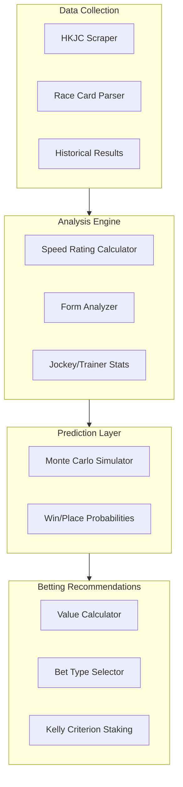
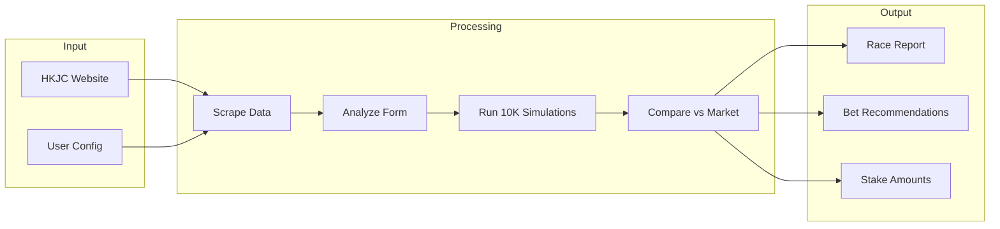
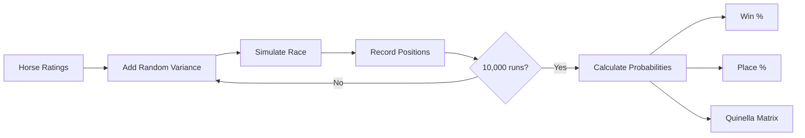
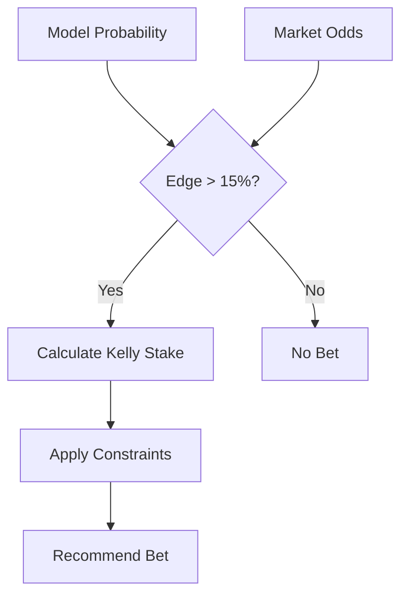

# HK Horse Racing AI

AI-assisted Hong Kong horse racing analysis and betting recommendation system.

## Overview

This project provides tools to:
- **Scrape** race data from HKJC (Hong Kong Jockey Club)
- **Analyze** horse performance using speed ratings, form analysis, and jockey/trainer statistics
- **Simulate** race outcomes using Monte Carlo methods
- **Recommend** value bets with Kelly Criterion staking

## Architecture



## Data Flow



## Project Structure

```
hourse-racing/
├── src/
│   ├── scrapers/           # HKJC data scrapers
│   ├── analysis/           # Statistical analysis modules
│   ├── simulation/         # Race simulation engine
│   ├── betting/            # Bet recommendation logic
│   ├── types/              # TypeScript interfaces
│   └── utils/              # Helper functions
├── data/                   # Cached race data (gitignored)
├── prompts/                # AI prompts for analysis
├── tools/                  # CLI tools
├── rules/                  # Cursor rules
└── skills/                 # Cursor skills
```

## Installation

```bash
npm install
npx playwright install chromium
```

## Usage

### Scrape Today's Race Card
```bash
npm run scrape:racecard
```

### Analyze a Race
```bash
npm run analyze -- --race 5 --date 2026-01-29
```

## Simulation Process



## Value Detection



## Betting Strategy

Based on research, this system focuses on:
- **Exotic bets** (Quinella, Place, Quinella Place) - pools are less efficient
- **Value threshold**: Only bet when model edge > 15%
- **Kelly staking**: 25-50% fractional Kelly for bankroll management

## Key Prediction Factors

1. Speed ratings (adjusted for class/going)
2. Class trajectory (horses dropping in class)
3. Jockey/Trainer win rates
4. Draw bias (track/distance specific)
5. Recent form and fitness

## Disclaimer

This project is for educational and research purposes only. Gambling involves risk. Never bet more than you can afford to lose.
